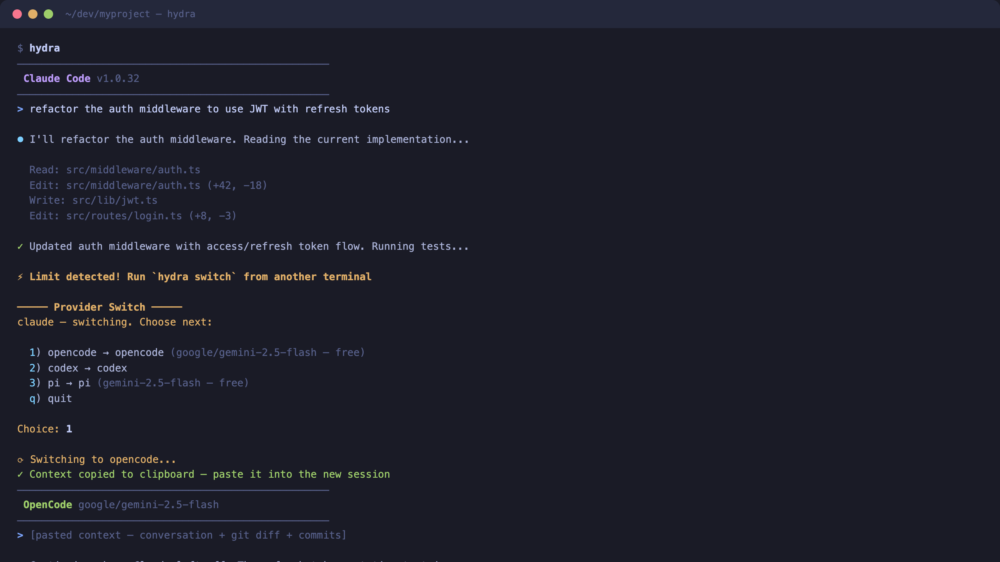

# hydra

Unified wrapper for AI coding CLIs. Run Claude Code, Codex, OpenCode, or Pi as a full interactive TUI. When one hits a rate limit, switch to another with your conversation context on the clipboard.

Cut one head off, another takes its place.



## Why

AI coding CLIs are incredible, but every one of them has usage limits. Hit your Claude Code cap mid-task and you're stuck — copy context manually, open a different tool, re-explain everything, lose your flow.

Hydra fixes this. You never stop coding because one provider ran out. Your fallback chain kicks in automatically, your context transfers with one paste, and you keep moving. No single provider becomes a bottleneck, and you're never locked into one ecosystem.

The free tiers alone (Gemini via OpenCode/Pi = 3000 req/day combined) mean you can code all day even after burning through paid limits.

## Install

```bash
go install github.com/saadnvd1/hydra@latest
```

Or build from source:

```bash
git clone https://github.com/saadnvd1/hydra.git
cd hydra
go build -o hydra .
sudo mv hydra /usr/local/bin/
```

## Setup

```bash
# Copy the example config
mkdir -p ~/.config/hydra
cp config.example.yaml ~/.config/hydra/config.yaml

# (Optional) Set up free model API keys for fallback providers
export GOOGLE_GENERATIVE_AI_API_KEY="your-key"  # for OpenCode — https://aistudio.google.com
export GEMINI_API_KEY="your-key"                 # for Pi — same key works
```

## Usage

```bash
hydra                      # start with primary provider (claude)
hydra codex                # start with specific provider
hydra switch               # switch ALL running sessions (from another terminal)
hydra --continue           # resume from last session with context on clipboard
hydra status               # show last session info
hydra config               # show loaded config
```

Extra flags are passed through to the initial provider:
```bash
hydra --model sonnet       # passes --model sonnet to claude
hydra codex --yolo         # passes --yolo to codex
```

## How It Works

1. `hydra` spawns your AI coding CLI in a PTY — full interactive TUI, identical to running it directly
2. Terminal output is monitored for rate limit / quota error patterns
3. When a limit is detected or you want to switch manually:
   - Open another terminal, run `hydra switch`
   - Sends SIGUSR1 to **all** running `hydra` sessions (rate limits are account-wide)
   - Each session shows a single-keypress provider picker
4. On switch: conversation context (history + git diff + recent commits) is extracted and copied to clipboard
5. New CLI spawns — paste context and continue

You can also press `Ctrl+]` inside a session to trigger a switch directly.

## Default Fallback Chain

| Order | Provider | Model | Cost |
|-------|----------|-------|------|
| 1 | Claude Code | Your default (Opus/Sonnet) | Paid (Max/Pro) |
| 2 | OpenCode | `google/gemini-2.5-flash` | Free (1500 req/day) |
| 3 | Codex | Default (OpenAI) | Paid |
| 4 | Pi | `gemini-2.5-flash` | Free (1500 req/day) |

Configure your own provider chain in `~/.config/hydra/config.yaml`.

## Config

```yaml
providers:
  - name: claude
    command: claude
    args: ["--dangerously-skip-permissions"]

  - name: opencode
    command: opencode
    args: ["-m", "google/gemini-2.5-flash"]
    env:
      OPENCODE_PERMISSION: '{"*":"allow"}'

  - name: codex
    command: codex
    args: ["--full-auto"]

  - name: pi
    command: pi
    args: ["--model", "gemini-2.5-flash"]

limit_patterns:
  - "rate limit"
  - "quota exceeded"
  - "usage limit"
  # ... see config.example.yaml for the full list
```

Override the config path with `HYDRA_CONFIG=/path/to/config.yaml`.

## Context Extraction

On provider switch, the clipboard gets:

- **Conversation history** — parsed from Claude Code's JSONL session files
- **Git diff** — all uncommitted changes
- **Recent commits** — last 5 for completed work context

## Multi-Session Support

Multiple `hydra` sessions can run simultaneously. `hydra switch` signals ALL of them — because rate limits are account-wide, if one session hits a limit, they all need to switch.

## Free API Keys

| Provider | Free Limit | Get Key |
|----------|-----------|---------|
| Google Gemini | 1500 req/day, 1M context | [aistudio.google.com](https://aistudio.google.com) |
| Groq | Generous daily limit | [console.groq.com](https://console.groq.com) |
| Cerebras | ~1700 req/day | [cerebras.ai](https://cerebras.ai) |

## Adding Your Own Provider

Any CLI that runs interactively in a terminal works. Add it to your config:

```yaml
providers:
  - name: my-tool
    command: /path/to/my-tool
    args: ["--some-flag"]
    env:
      MY_VAR: "value"
```

## Requirements

- macOS, Linux, or WSL (PTY-based — needs a Unix terminal)
- At least one AI coding CLI installed
- `xclip` or `xsel` on Linux for clipboard support

## License

MIT
